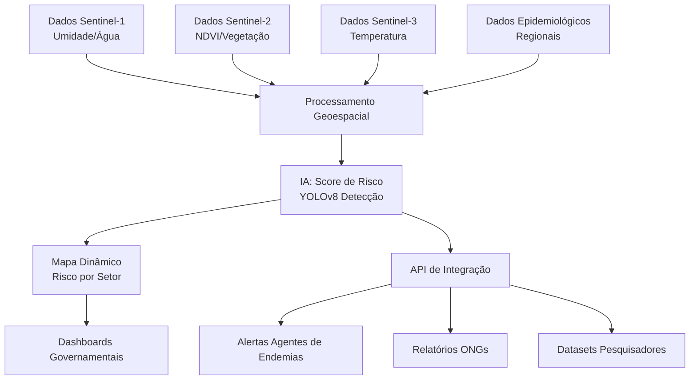

# 🛰️ NAIÁ - Sistema Inteligente de Monitoramento de Criadouros de Mosquitos
**Hackathon CopernicusLAC Panamá 2025**

<div align="center">
  
</div>

---

## 🛰️ Sobre o Projeto

O **NAIÁ** é um **protótipo funcional** desenvolvido para o **Copernicus Hackathon Panamá LAC 2025** que revoluciona o monitoramento de doenças transmitidas por mosquitos como dengue, zika e chikungunya.

### 🎯 **O Problema que Resolvemos**
Milhões de pessoas são afetadas anualmente por doenças transmitidas pelo *Aedes aegypti* na América Latina. A detecção manual de criadouros é lenta, cara e ineficiente para cobrir grandes áreas urbanas.

### 🚀 **Nossa Solução**
Combinamos **dados de satélite Sentinel-1/2** com **inteligência artificial** para:
- ✅ **Detectar automaticamente piscinas sujas** via computer vision
- ✅ **Calcular scores de risco** por setor censitário usando dados climáticos e ambientais
- ✅ **Gerar mapas interativos** para priorização de ações de saúde pública
- ✅ **Processar grandes áreas** em minutos (vs. semanas de inspeção manual)

### 🔬 **Status Atual - Demo Funcional**
- **✅ FUNCIONANDO:** Detecção automática de piscinas via IA (YOLOv8)
- **✅ FUNCIONANDO:** Pipeline completo de processamento de dados de satélite
- **✅ FUNCIONANDO:** Interface web para análise interativa
- **⚡ EM EVOLUÇÃO:** Scoring de risco (atualmente lógica simples, futuro: IA)

### 🗺️ **Dependências de Dados Geoespaciais**
- **Dados do IBGE:** O NAIÁ utiliza shapefiles do IBGE para definir setores censitários, recortando-os com base na área de estudo (GeoJSON gerado em `study_area.geojson`). Isso garante precisão na análise espacial por setor, essencial para o cálculo de risco e detecção de criadouros.
- **Foco em Campinas:** A configuração padrão (em `settings.py`) usa coordenadas de Barão Geraldo, Campinas, para processar dados locais. O pipeline gera dinamicamente o GeoJSON da área de estudo a partir do shapefile IBGE, sem depender de arquivos fixos como `campinas_all.json`.
- **Por que essa abordagem:** Os dados do IBGE oferecem alta granularidade (setores censitários) e padronização nacional, ideais para análises urbanas. A geração dinâmica do GeoJSON permite flexibilidade para outras regiões, ajustando apenas o bounding box.
- **Futuro:** Suportar outros formatos de dados geoespaciais (e.g., OpenStreetMap) e integrar dados epidemiológicos locais para personalização regional.

### 🌍 **Potencial de Escalabilidade**
- **Governos:** Monitoramento preventivo em tempo real
- **ONGs:** Campanhas direcionadas de saúde pública  
- **Pesquisadores:** Correlação entre fatores ambientais e surtos
- **Expansão:** Aplicável a qualquer região tropical do mundo

---

## ⚙️ Como Executar Localmente

### 📋 **Pré-requisitos**
```bash
Python 3.12.7
pip (gerenciador de pacotes)
Git
```

### 🔧 **Instalação**

1. **Clone o repositório:**
   ```bash
   git clone https://github.com/AnaBeatrizHidalgo/CorpenicusHackthon.git
   cd CorpenicusHackthon
   ```

2. **Instale as dependências:**
   ```bash
   pip install -r requirements.txt
   ```

3. **Configure as credenciais (obrigatório):**
   
   Crie um arquivo `.env` na raiz com:
   ```env
   CLIENT_ID=seu_copernicus_client_id
   CLIENT_SECRET_ID=seu_copernicus_client_secret
   Maps_API_KEY=sua_google_maps_api_key
   ```
   
   📝 **Onde obter as credenciais:**
   - **Copernicus:** Registre-se em [dataspace.copernicus.eu](https://dataspace.copernicus.eu)
   - **Google Maps:** Console de APIs do Google Cloud

### 🚀 **Executar o Sistema**

```bash
python app.py
```

Acesse: `http://localhost:5000`

### 🎮 **Como Usar**
1. Na interface web, clique no mapa para selecionar uma região
2. Ajuste o tamanho da área de análise (padrão: 15km)
3. Clique em "Iniciar Análise"
4. Aguarde o processamento (2-5 minutos)
5. Visualize o mapa de risco interativo gerado

---

## 🧩 Estrutura do Projeto e Funcionalidade dos Arquivos

### 📁 **app.py** - Servidor Web Principal
- **Como funciona:** Flask API com threading para executar análises em background sem bloquear a interface. Usa `threading.Thread` para processar requisições assincronamente e armazena status em memória (`analysis_status`).
- **Por que essa arquitetura:** Análises geoespaciais demoram 2-5 minutos, logo interface precisa ser não-bloqueante. Flask threads permitem múltiplas análises simultâneas sem overhead de message queues.
- **Dados técnicos:** Serve arquivos estáticos via `send_from_directory`, logs estruturados, endpoints REST para status tracking.
- **Futuro:** Migrar para Celery+Redis para escalabilidade, adicionar WebSocket para updates em tempo real.

### 📁 **run_analysis.py** - Pipeline Principal de Análise
- **Como funciona:** Pipeline sequencial com 7 etapas: (1) recorte de setores censitários, (2) download Sentinel-1/2, (3) download ERA5-Land, (4) processamento de imagens, (5) extração de features, (6) cálculo de risco, (7) detecção de piscinas via IA, (8) geração de mapas.
- **Por que essa sequência:** Cada etapa depende da anterior - precisa dos setores para definir área de download, das imagens para calcular NDVI, das features para scoring de risco. Usa `safe_execute()` para tratamento robusto de erros.
- **Dados técnicos:** Gerencia paths dinâmicos, conversão de coordenadas, merge de GeoDataFrames, preserva `risk_score` original vs `amplified_risk_score`.
- **Futuro:** Paralelização via Apache Airflow, cache inteligente, retry automático com backoff.

### 📁 **src/config/settings.py** - Configuração Central
- **Como funciona:** Define configurações globais, como credenciais de API (Copernicus, Google Maps), área de estudo (bounding box, CRS), intervalos de tempo para análise, e parâmetros de modelos de machine learning, carregados de um arquivo `.env` para segurança.
- **Por que essa abordagem:** Centraliza configurações em um único arquivo, facilitando manutenção e garantindo segurança ao evitar credenciais no código. Suporta múltiplos períodos de análise (e.g., monitoramento, validação histórica).
- **Implementação técnica:** Usa `dotenv` para carregar variáveis de ambiente, define `STUDY_AREA` com coordenadas corrigidas para Barão Geraldo, e suporta parametrização flexível via dicionários (`DATA_RANGES`, `MODEL_PARAMS`).
- **Futuro:** Adicionar validação de configuração no startup, suportar configuração dinâmica via interface web, e integrar com sistemas de gerenciamento de configuração (e.g., YAML).

### 📁 **src/utils/paths.py** - Gerenciamento de Diretórios
- **Como funciona:** Define a estrutura de diretórios do projeto (e.g., `data`, `output`, `models`) e cria pastas necessárias no início do pipeline usando `pathlib.Path` para compatibilidade multiplataforma.
- **Por que essa abordagem:** Garante que todos os diretórios necessários existam antes da execução, evitando erros de I/O. Centraliza caminhos em um único módulo para consistência e fácil manutenção.
- **Implementação técnica:** Define caminhos relativos à raiz do projeto (`BASE_DIR`), cria diretórios com `mkdir(parents=True, exist_ok=True)`, e inclui logging para rastrear erros.
- **Futuro:** Adicionar verificação de permissões de escrita, suportar caminhos configuráveis via `settings.py`, e integrar com sistemas de armazenamento em nuvem (e.g., S3).

### 📁 **src/utils/geoprocessing.py** - Processamento Geoespacial
- **Como funciona:** Cria um GeoJSON da área de estudo recortando um shapefile nacional (IBGE) com base em coordenadas centrais e tamanho em quilômetros, convertendo para graus com precisão.
- **Por que essa abordagem:** Permite focar a análise em uma área específica, reduzindo o volume de dados processados. Usa `geopandas` para manipulação eficiente de dados vetoriais e validação rigorosa do bounding box.
- **Implementação técnica:** Converte quilômetros para graus considerando a variação de longitude com a latitude (`cos(latitude)`), usa `gpd.read_file` com `bbox` para otimizar leitura, e garante CRS `EPSG:4326`. Salva o resultado como GeoJSON.
- **Futuro:** Suportar shapefiles regionais para reduzir tempo de leitura, adicionar buffer configurável ao bounding box, e otimizar para grandes shapefiles com índices espaciais.

### 📁 **src/data/sentinel_downloader.py** - Download de Dados Sentinel
- **Como funciona:** Baixa imagens Sentinel-1 (SAR: VV, VH) e Sentinel-2 (ópticas: B04, B03, B02, B08) via Sentinel Hub API, valida o formato TIFF, e gerencia cache temporário.
- **Por que essa abordagem:** Sentinel-1 detecta superfícies aquáticas mesmo com nuvens, enquanto Sentinel-2 fornece dados ópticos para NDVI. A API Sentinel Hub simplifica o acesso a dados processados, e a validação garante integridade.
- **Implementação técnica:** Usa `sentinelhub` com evalscripts customizados, autentica com credenciais do Copernicus Data Space, e corrige número de bandas se necessário. Cache local evita downloads redundantes.
- **Futuro:** Implementar re-tentativas automáticas, suportar outras coleções (e.g., Sentinel-3), e otimizar para downloads paralelos.

### 📁 **src/data/climate_downloader.py** - Download de Dados Climáticos
- **Como funciona:** Baixa dados ERA5-Land (precipitação, temperatura) do Copernicus Climate Data Store (CDS) para uma área e período especificados, lidando com descompactação de arquivos ZIP para NetCDF.
- **Por que essa abordagem:** ERA5-Land oferece alta resolução (0.1°) para variáveis climáticas críticas (chuva, temperatura) correlacionadas com proliferação de mosquitos. A descompactação resolve problemas de formato da API.
- **Implementação técnica:** Usa `cdsapi`, valida área (Norte > Sul, Oeste < Leste), ajusta áreas grandes para limites da API, e inclui grid de 0.1°. Usa prints para feedback claro e limpeza de arquivos temporários.
- **Futuro:** Adicionar suporte a mais variáveis (e.g., umidade), implementar cache de dados climáticos, e paralelizar downloads para múltiplos meses.

### 📁 **src/features/image_processor.py** - Processamento de Imagens
- **Como funciona:** Recorta imagens Sentinel-1/2 por setores censitários usando GeoJSON, salvando TIFFs por setor. Inclui localização automática de arquivos, validação de rasters, e verificação de sobreposição espacial.
- **Por que essa abordagem:** Reduz o volume de dados processados, focando em setores relevantes, e garante robustez com validação de dados e fallback para localização de arquivos. Facilita cálculos de métricas (e.g., NDVI) por setor.
- **Implementação técnica:** Usa `rasterio` para recorte com `mask`, `geopandas` para geometrias, e validação de pixels válidos. Localiza arquivos via padrões de nomeação (e.g., `s1`, `s2`) e suporta reprojeção de CRS.
- **Futuro:** Paralelizar recortes com `multiprocessing`, suportar resoluções dinâmicas, e integrar com processamento em GPU para acelerar.

### 📁 **src/features/climate_feature_builder.py** - Agregação de Dados Climáticos
- **Como funciona:** Agrega dados climáticos ERA5-Land (e.g., temperatura, precipitação) por setor censitário, associando valores de pixels próximos aos centroides dos setores. Inclui fallback para valores médios regionais se os dados falharem.
- **Por que essa abordagem:** Permite correlacionar variáveis climáticas com risco de dengue em nível de setor, usando um método eficiente baseado em centroides devido à resolução do ERA5-Land (~9-11 km). O fallback garante continuidade.
- **Implementação técnica:** Usa `xarray` para NetCDF, `geopandas` para setores, e Haversine para distâncias. Converte temperatura de Kelvin para Celsius e salva resultados em CSV.
- **Futuro:** Adicionar agregação temporal (e.g., médias semanais), suportar mais variáveis (e.g., umidade), e usar índices espaciais para otimizar.

### 📁 **src/analysis/map_generator.py** - Geração de Mapas Interativos
- **Como funciona:** Cria mapas HTML interativos com `folium`, exibindo setores coloridos por nível de risco (baseado em percentis) e marcadores de piscinas sujas com popups contendo imagens e métricas detalhadas.
- **Por que essa abordagem:** Mapas interativos facilitam a visualização para tomadores de decisão, com cores consistentes (percentis 70% e 90%) e imagens embedadas para validação visual de piscinas. O tema dark melhora a estética.
- **Implementação técnica:** Usa `geopandas` para dados espaciais, `folium` para mapas, e `base64` for imagens. Inclui validação de geometrias, percentis dinâmicos, e CSS/JavaScript customizado para interatividade.
- **Futuro:** Adicionar filtros interativos (e.g., por nível de risco), exportar mapas em PDF, e integrar com dashboards em tempo real via API.

### 📁 **src/features/metrics_calculator.py** - Cálculo de Métricas de Imagem
- **Como funciona:** Usa `rasterio` para ler imagens TIFF recortadas por setor, calcula NDVI (vegetação) a partir das bandas Red/NIR do Sentinel-2, e backscatter VV/VH do Sentinel-1 (radar). Processa arquivos via pattern matching de nomes.
- **Por que essas métricas:** NDVI indica cobertura vegetal (correlação negativa com dengue), VV/VH detectam superfícies aquáticas e rugosidade urbana. Dados científicos mostram correlação entre vegetação urbana baixa e proliferação de mosquitos.
- **Implementação técnica:** Evita divisão por zero no NDVI, usa `np.nanmean` para ignorar pixels inválidos, merge baseado em `CD_SETOR` (código único do setor censitário).
- **Futuro:** Adicionar índices como NDWI (água), NDBI (áreas construídas), processamento temporal para detectar mudanças sazonais.

### 📁 **src/analysis/risk_assessor.py** - Cálculo Inteligente de Risco
- **Como funciona:** Aplica pesos baseados na literatura científica para cada variável: precipitação (40%), temperatura (35%), SAR VV (25%), SAR VH (15%), NDVI (-15% - correlação negativa). Normaliza dados para [0,1] e usa percentis para classificação restritiva.
- **Por que esses pesos:** Baseados em estudos epidemiológicos (PMC9767811, PMC7007072) que mostram precipitação como fator crítico (r=0.38), temperatura como muito importante (r=0.28-0.30), e vegetação com correlação negativa.
- **Implementação técnica:** Normalização por faixas ótimas conhecidas (20-28°C para temperatura, 60-240mm/mês para chuva), classificação pelos percentis 90% (alto) e 70% (médio) para garantir especificidade.
- **Futuro:** Substituir por Random Forest/XGBoost treinado em dados reais de surtos, adicionar variáveis socioeconômicas, validação com dados epidemiológicos históricos.

### 📁 **src/models/pool_detector.py** - Detecção de Piscinas via IA
- **Como funciona:** Baixa imagens de satélite de alta resolução via Google Maps Static API (640x640px, zoom 19), roda YOLOv8 pré-treinado para detectar piscinas, aplica análise HSV para identificar água suja/esverdeada, e estima coordenadas geográficas via projeção Mercator.
- **Por que essa abordagem:** Google Maps oferece resolução superior aos satélites gratuitos (~60cm/pixel vs 10m), YOLOv8 é estado-da-arte para detecção de objetos, análise HSV é robusta para distinguir água limpa (azul) de suja (verde).
- **Implementação técnica:** Modelo YOLOv8 carregado de arquivo local (.pt), conversão pixel→coordenadas via fórmulas Mercator, threshold HSV configurável para água suja, confidence threshold de 0.25.
- **Futuro:** Fine-tuning do YOLOv8 em dataset local, detecção de outros criadouros (caixas d'água, pneus), integração com Street View para validação ground-truth.

---

## 🌎 Como Personalizar os Dados

### 📍 **Trocar Região de Análise**
```python
# Em src/config/settings.py, modifique:
STUDY_AREA = {
    "bbox": [-47.11, -22.85, -47.03, -22.77],  # [min_lon, min_lat, max_lon, max_lat]
    # Substitua pelas coordenadas da sua região de interesse
}
```

### 📅 **Alterar Período de Análise**
```python
# Em src/config/settings.py:
DATA_RANGES = {
    "monitoramento_dengue": {
        "start": "2024-07-01",  # Modifique aqui
        "end": "2024-07-30",    # E aqui
    }
}
```

### ⚙️ **Ajustar Parâmetros via Interface Web**
- **Tamanho da área:** Slider na interface (5-50km)
- **Coordenadas:** Clique no mapa interativo
- **Confiança da IA:** Modificar `CONFIDENCE_THRESHOLD` em `run_analysis.py`

---

## 💡 Possibilidades Futuras e Escalabilidade

### 🏗️ **Arquitetura para Produção**
- **Microserviços:** Separar download, processamento e análise
- **Queue System:** Redis/RabbitMQ para processamento assíncrono
- **Database:** PostgreSQL + PostGIS para dados geoespaciais
- **Cache:** Redis para resultados frequentes
- **Monitoring:** Prometheus + Grafana para observabilidade

### 🤖 **Evolução da IA**
- **Scoring Inteligente:** Substituir lógica simples por Random Forest/XGBoost
- **Deep Learning:** CNNs para análise direta de imagens de satélite
- **Temporal Analysis:** LSTM para previsão de surtos
- **Multi-modal:** Integração de dados sociais, econômicos e climáticos

### 🌐 **Escalabilidade Operacional**


### 📊 **Integrações Futuras**
- **Prefeituras:** Dashboards executivos, alertas SMS
- **Ministérios da Saúde:** APIs para sistemas nacionais de vigilância
- **Pesquisadores:** Datasets para estudos epidemiológicos
- **Cidadãos:** App mobile para denúncias colaborativas

### 🚀 **Roadmap Técnico**
1. **Fase 1:** Containerização + CI/CD (Docker, GitHub Actions)
2. **Fase 2:** Cloud deployment (AWS/GCP) + autoscaling
3. **Fase 3:** Real-time processing + streaming de dados
4. **Fase 4:** Multi-país + multi-idioma + IA federada

---

## 📷 Exemplos de Resultado

*[Seção será atualizada com screenshots ]

---

**🏆 Desenvolvido para o Copernicus Hackathon Panamá LAC 2025**  
*Transformando dados de satélite em saúde pública inteligente*