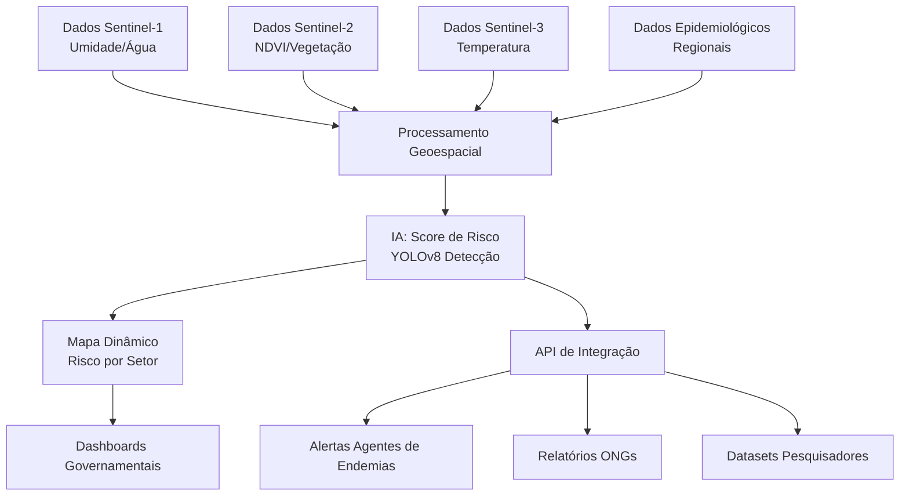

# 🛰️ NAIÁ - Sistema Inteligente de Monitoramento de Criadouros de Mosquitos

<div align="center">

[](https://github.com)
[](https://github.com)
[](https://python.org)
[](LICENSE)

**Transformando dados de satélite em saúde pública inteligente**

[🚀 Demo](#-como-executar-localmente) • [📖 Documentação](#-estrutura-do-projeto-e-funcionalidade-dos-arquivos) • [🎯 Solução](#-nossa-solução) • [🌍 Escalabilidade](#-potencial-de-escalabilidade)

</div>

---

## 🛰️ Sobre o Projeto

> **NAIÁ** é um protótipo funcional revolucionário desenvolvido para o **Copernicus Hackathon Panamá LAC 2025** que combina inteligência artificial com dados de satélite para combater doenças transmitidas por mosquitos como dengue, zika e chikungunya.

<div align="center">


</div>

---

## 🎯 O Problema que Resolvemos

<table>
<tr>
<td>

**❌ Situação Atual**
- Milhões afetados na América Latina
- Detecção manual lenta e cara
- Cobertura limitada de grandes áreas
- Inspeções demoram semanas

</td>
<td>

**✅ Com NAIÁ**
- Detecção automática via IA
- Processamento em minutos  
- Cobertura de grandes áreas urbanas
- Priorização inteligente de ações

</td>
</tr>
</table>

---

## 🚀 Nossa Solução

<div align="center">

### 🎯 **Combinamos dados de satélite Sentinel-1/2 com inteligência artificial para:**

</div>

<div align="center">
<table>
<tr>
<td align="center">
<br>
<strong>Detecção automática via computer vision</strong>
</td>
<td align="center">
<br>
<strong>Cálculo por setor censitário</strong>
</td>
</tr>
<tr>
<td align="center">
<br>
<strong>Priorização de ações de saúde</strong>
</td>
<td align="center">
<br>
<strong>Minutos vs. semanas de inspeção</strong>
</td>
</tr>
</table>
</div>

---

## 🔬 Status Atual - Demo Funcional

<div align="center">

| Funcionalidade | Status | Descrição |
|---|---|---|
| 🤖 **Detecção de Piscinas** | ✅ **FUNCIONANDO** | IA YOLOv8 para computer vision |
| 🛰️ **Pipeline de Satélite** | ✅ **FUNCIONANDO** | Processamento completo Sentinel-1/2 |
| 🌐 **Interface Web** | ✅ **FUNCIONANDO** | Análise interativa em tempo real |
| 📊 **Scoring de Risco** | ⚡ **EM EVOLUÇÃO** | Lógica simples → IA avançada |

</div>

---

## 🗺️ Dependências de Dados Geoespaciais

<details>
<summary><strong>📍 Clique para expandir detalhes técnicos</strong></summary>

### **Dados do IBGE**
- Utiliza shapefiles do IBGE para setores censitários
- Recorte baseado na área de estudo (GeoJSON em `study_area.geojson`)
- Precisão na análise espacial por setor

### **Foco em Campinas** 
- Configuração padrão em `settings.py` usa Barão Geraldo, Campinas
- Pipeline gera dinamicamente GeoJSON da área de estudo
- Sem dependência de arquivos fixos como `campinas_all.json`

### **Por que essa abordagem?**
- **Alta granularidade:** Setores censitários do IBGE
- **Padronização nacional:** Ideal para análises urbanas  
- **Flexibilidade:** Ajuste apenas do bounding box para outras regiões

### **Futuro**
- Suporte a OpenStreetMap
- Integração com dados epidemiológicos locais
- Personalização regional avançada

</details>

---

## 🌍 Potencial de Escalabilidade

<div align="center">
<table>
<tr>
<td align="center">
<br>
<strong>Monitoramento preventivo em tempo real</strong>
</td>
<td align="center">
<br>
<strong>Campanhas direcionadas de saúde pública</strong>
</td>
</tr>
<tr>
<td align="center">
<br>
<strong>Correlação fatores ambientais e surtos</strong>
</td>
<td align="center">
<br>
<strong>Aplicável a qualquer região tropical</strong>
</td>
</tr>
</table>
</div>

---

## ⚙️ Como Executar Localmente

### 📋 Pré-requisitos

<div align="center">


</div>

### 🔧 Instalação

```bash
# 1. Clone o repositório
git clone https://github.com/AnaBeatrizHidalgo/CorpenicusHackthon.git
cd CorpenicusHackthon

# 2. Instale as dependências
pip install -r requirements.txt

# 3. Configure as credenciais (obrigatório)
# Crie um arquivo .env na raiz com:
CLIENT_ID=seu_copernicus_client_id
CLIENT_SECRET_ID=seu_copernicus_client_secret
Maps_API_KEY=sua_google_maps_api_key
```

### 📝 Onde obter as credenciais

| Serviço | Link | Descrição |
|---------|------|-----------|
| **Copernicus** | [dataspace.copernicus.eu](https://dataspace.copernicus.eu) | Dados de satélite Sentinel |
| **Google Maps** | [Console de APIs do Google Cloud](https://console.cloud.google.com) | Imagens de alta resolução |

### 🚀 Executar o Sistema

```bash
python app.py
```

<div align="center">

**🌐 Acesse:** [http://localhost:5000](http://localhost:5000)

</div>

### 🎮 Como Usar

<div align="center">
<table>
<tr>
<td align="center">1️⃣</td>
<td><strong>Selecionar região:</strong> Clique no mapa</td>
</tr>
<tr>
<td align="center">2️⃣</td>
<td><strong>Ajustar área:</strong> Tamanho padrão 15km</td>
</tr>
<tr>
<td align="center">3️⃣</td>
<td><strong>Iniciar análise:</strong> Clique no botão</td>
</tr>
<tr>
<td align="center">4️⃣</td>
<td><strong>Aguardar:</strong> Processamento 2-5 minutos</td>
</tr>
<tr>
<td align="center">5️⃣</td>
<td><strong>Visualizar:</strong> Mapa de risco interativo</td>
</tr>
</table>
</div>

---

## 🧩 Estrutura do Projeto e Funcionalidade dos Arquivos

<details>
<summary><strong>📁 app.py - Servidor Web Principal</strong></summary>

**Como funciona:** Flask API com threading para executar análises em background sem bloquear a interface. Usa `threading.Thread` para processar requisições assincronamente e armazena status em memória (`analysis_status`).

**Por que essa arquitetura:** Análises geoespaciais demoram 2-5 minutos, logo interface precisa ser não-bloqueante. Flask threads permitem múltiplas análises simultâneas sem overhead de message queues.

**Dados técnicos:** Serve arquivos estáticos via `send_from_directory`, logs estruturados, endpoints REST para status tracking.

**Futuro:** Migrar para Celery+Redis para escalabilidade, adicionar WebSocket para updates em tempo real.

</details>

<details>
<summary><strong>📁 run_analysis.py - Pipeline Principal de Análise</strong></summary>

**Como funciona:** Pipeline sequencial com 7 etapas: (1) recorte de setores censitários, (2) download Sentinel-1/2, (3) download ERA5-Land, (4) processamento de imagens, (5) extração de features, (6) cálculo de risco, (7) detecção de piscinas via IA, (8) geração de mapas.

**Por que essa sequência:** Cada etapa depende da anterior - precisa dos setores para definir área de download, das imagens para calcular NDVI, das features para scoring de risco. Usa `safe_execute()` para tratamento robusto de erros.

**Dados técnicos:** Gerencia paths dinâmicos, conversão de coordenadas, merge de GeoDataFrames, preserva `risk_score` original vs `amplified_risk_score`.

**Futuro:** Paralelização via Apache Airflow, cache inteligente, retry automático com backoff.

</details>

<details>
<summary><strong>📁 src/config/settings.py - Configuração Central</strong></summary>

**Como funciona:** Define configurações globais, como credenciais de API (Copernicus, Google Maps), área de estudo (bounding box, CRS), intervalos de tempo para análise, e parâmetros de modelos de machine learning, carregados de um arquivo `.env` para segurança.

**Por que essa abordagem:** Centraliza configurações em um único arquivo, facilitando manutenção e garantindo segurança ao evitar credenciais no código. Suporta múltiplos períodos de análise (e.g., monitoramento, validação histórica).

**Implementação técnica:** Usa `dotenv` para carregar variáveis de ambiente, define `STUDY_AREA` com coordenadas corrigidas para Barão Geraldo, e suporta parametrização flexível via dicionários (`DATA_RANGES`, `MODEL_PARAMS`).

**Futuro:** Adicionar validação de configuração no startup, suportar configuração dinâmica via interface web, e integrar com sistemas de gerenciamento de configuração (e.g., YAML).

</details>

<details>
<summary><strong>📁 src/utils/paths.py - Gerenciamento de Diretórios</strong></summary>

**Como funciona:** Define a estrutura de diretórios do projeto (e.g., data, output, models) e cria pastas necessárias no início do pipeline usando `pathlib.Path` para compatibilidade multiplataforma.

**Por que essa abordagem:** Garante que todos os diretórios necessários existam antes da execução, evitando erros de I/O. Centraliza caminhos em um único módulo para consistência e fácil manutenção.

**Implementação técnica:** Define caminhos relativos à raiz do projeto (`BASE_DIR`), cria diretórios com `mkdir(parents=True, exist_ok=True)`, e inclui logging para rastrear erros.

**Futuro:** Adicionar verificação de permissões de escrita, suportar caminhos configuráveis via settings.py, e integrar com sistemas de armazenamento em nuvem (e.g., S3).

</details>

<details>
<summary><strong>📁 src/utils/geoprocessing.py - Processamento Geoespacial</strong></summary>

**Como funciona:** Cria um GeoJSON da área de estudo recortando um shapefile nacional (IBGE) com base em coordenadas centrais e tamanho em quilômetros, convertendo para graus com precisão.

**Por que essa abordagem:** Permite focar a análise em uma área específica, reduzindo o volume de dados processados. Usa geopandas para manipulação eficiente de dados vetoriais e validação rigorosa do bounding box.

**Implementação técnica:** Converte quilômetros para graus considerando a variação de longitude com a latitude (`cos(latitude)`), usa `gpd.read_file` com bbox para otimizar leitura, e garante CRS EPSG:4326. Salva o resultado como GeoJSON.

**Futuro:** Suportar shapefiles regionais para reduzir tempo de leitura, adicionar buffer configurável ao bounding box, e otimizar para grandes shapefiles com índices espaciais.

</details>

<details>
<summary><strong>📁 src/data/sentinel_downloader.py - Download de Dados Sentinel</strong></summary>

**Como funciona:** Baixa imagens Sentinel-1 (SAR: VV, VH) e Sentinel-2 (ópticas: B04, B03, B02, B08) via Sentinel Hub API, valida o formato TIFF, e gerencia cache temporário.

**Por que essa abordagem:** Sentinel-1 detecta superfícies aquáticas mesmo com nuvens, enquanto Sentinel-2 fornece dados ópticos para NDVI. A API Sentinel Hub simplifica o acesso a dados processados, e a validação garante integridade.

**Implementação técnica:** Usa `sentinelhub` com evalscripts customizados, autentica com credenciais do Copernicus Data Space, e corrige número de bandas se necessário. Cache local evita downloads redundantes.

**Futuro:** Implementar re-tentativas automáticas, suportar outras coleções (e.g., Sentinel-3), e otimizar para downloads paralelos.

</details>

<details>
<summary><strong>📁 src/data/climate_downloader.py - Download de Dados Climáticos</strong></summary>

**Como funciona:** Baixa dados ERA5-Land (precipitação, temperatura) do Copernicus Climate Data Store (CDS) para uma área e período especificados, lidando com descompactação de arquivos ZIP para NetCDF.

**Por que essa abordagem:** ERA5-Land oferece alta resolução (0.1°) para variáveis climáticas críticas (chuva, temperatura) correlacionadas com proliferação de mosquitos. A descompactação resolve problemas de formato da API.

**Implementação técnica:** Usa `cdsapi`, valida área (Norte > Sul, Oeste < Leste), ajusta áreas grandes para limites da API, e inclui grid de 0.1°. Usa prints para feedback claro e limpeza de arquivos temporários.

**Futuro:** Adicionar suporte a mais variáveis (e.g., umidade), implementar cache de dados climáticos, e paralelizar downloads para múltiplos meses.

</details>

<details>
<summary><strong>📁 src/features/image_processor.py - Processamento de Imagens</strong></summary>

**Como funciona:** Recorta imagens Sentinel-1/2 por setores censitários usando GeoJSON, salvando TIFFs por setor. Inclui localização automática de arquivos, validação de rasters, e verificação de sobreposição espacial.

**Por que essa abordagem:** Reduz o volume de dados processados, focando em setores relevantes, e garante robustez com validação de dados e fallback para localização de arquivos. Facilita cálculos de métricas (e.g., NDVI) por setor.

**Implementação técnica:** Usa `rasterio` para recorte com mask, `geopandas` para geometrias, e validação de pixels válidos. Localiza arquivos via padrões de nomeação (e.g., s1, s2) e suporta reprojeção de CRS.

**Futuro:** Paralelizar recortes com multiprocessing, suportar resoluções dinâmicas, e integrar com processamento em GPU para acelerar.

</details>

<details>
<summary><strong>📁 src/features/climate_feature_builder.py - Agregação de Dados Climáticos</strong></summary>

**Como funciona:** Agrega dados climáticos ERA5-Land (e.g., temperatura, precipitação) por setor censitário, associando valores de pixels próximos aos centroides dos setores. Inclui fallback para valores médios regionais se os dados falharem.

**Por que essa abordagem:** Permite correlacionar variáveis climáticas com risco de dengue em nível de setor, usando um método eficiente baseado em centroides devido à resolução do ERA5-Land (~9-11 km). O fallback garante continuidade.

**Implementação técnica:** Usa `xarray` para NetCDF, `geopandas` para setores, e Haversine para distâncias. Converte temperatura de Kelvin para Celsius e salva resultados em CSV.

**Futuro:** Adicionar agregação temporal (e.g., médias semanais), suportar mais variáveis (e.g., umidade), e usar índices espaciais para otimizar.

</details>

<details>
<summary><strong>📁 src/analysis/map_generator.py - Geração de Mapas Interativos</strong></summary>

**Como funciona:** Cria mapas HTML interativos com folium, exibindo setores coloridos por nível de risco (baseado em percentis) e marcadores de piscinas sujas com popups contendo imagens e métricas detalhadas.

**Por que essa abordagem:** Mapas interativos facilitam a visualização para tomadores de decisão, com cores consistentes (percentis 70% e 90%) e imagens embedadas para validação visual de piscinas. O tema dark melhora a estética.

**Implementação técnica:** Usa `geopandas` para dados espaciais, `folium` para mapas, e base64 for imagens. Inclui validação de geometrias, percentis dinâmicos, e CSS/JavaScript customizado para interatividade.

**Futuro:** Adicionar filtros interativos (e.g., por nível de risco), exportar mapas em PDF, e integrar com dashboards em tempo real via API.

</details>

<details>
<summary><strong>📁 src/features/metrics_calculator.py - Cálculo de Métricas de Imagem</strong></summary>

**Como funciona:** Usa `rasterio` para ler imagens TIFF recortadas por setor, calcula NDVI (vegetação) a partir das bandas Red/NIR do Sentinel-2, e backscatter VV/VH do Sentinel-1 (radar). Processa arquivos via pattern matching de nomes.

**Por que essas métricas:** NDVI indica cobertura vegetal (correlação negativa com dengue), VV/VH detectam superfícies aquáticas e rugosidade urbana. Dados científicos mostram correlação entre vegetação urbana baixa e proliferação de mosquitos.

**Implementação técnica:** Evita divisão por zero no NDVI, usa `np.nanmean` para ignorar pixels inválidos, merge baseado em `CD_SETOR` (código único do setor censitário).

**Futuro:** Adicionar índices como NDWI (água), NDBI (áreas construídas), processamento temporal para detectar mudanças sazonais.

</details>

<details>
<summary><strong>📁 src/analysis/risk_assessor.py - Cálculo Inteligente de Risco</strong></summary>

**Como funciona:** Aplica pesos baseados na literatura científica para cada variável: precipitação (40%), temperatura (35%), SAR VV (25%), SAR VH (15%), NDVI (-15% - correlação negativa). Normaliza dados para [0,1] e usa percentis para classificação restritiva.

**Por que esses pesos:** Baseados em estudos epidemiológicos (PMC9767811, PMC7007072) que mostram precipitação como fator crítico (r=0.38), temperatura como muito importante (r=0.28-0.30), e vegetação com correlação negativa.

**Implementação técnica:** Normalização por faixas ótimas conhecidas (20-28°C para temperatura, 60-240mm/mês para chuva), classificação pelos percentis 90% (alto) e 70% (médio) para garantir especificidade.

**Futuro:** Substituir por Random Forest/XGBoost treinado em dados reais de surtos, adicionar variáveis socioeconômicas, validação com dados epidemiológicos históricos.

</details>

<details>
<summary><strong>📁 src/models/pool_detector.py - Detecção de Piscinas via IA</strong></summary>

**Como funciona:** Baixa imagens de satélite de alta resolução via Google Maps Static API (640x640px, zoom 19), roda YOLOv8 pré-treinado para detectar piscinas, aplica análise HSV para identificar água suja/esverdeada, e estima coordenadas geográficas via projeção Mercator.

**Por que essa abordagem:** Google Maps oferece resolução superior aos satélites gratuitos (~60cm/pixel vs 10m), YOLOv8 é estado-da-arte para detecção de objetos, análise HSV é robusta para distinguir água limpa (azul) de suja (verde).

**Implementação técnica:** Modelo YOLOv8 carregado de arquivo local (.pt), conversão pixel→coordenadas via fórmulas Mercator, threshold HSV configurável para água suja, confidence threshold de 0.25.

**Futuro:** Fine-tuning do YOLOv8 em dataset local, detecção de outros criadouros (caixas d'água, pneus), integração com Street View para validação ground-truth.

</details>

---

## 🌎 Como Personalizar os Dados

### 📍 Trocar Região de Análise

```python
# Em src/config/settings.py, modifique:
STUDY_AREA = {
    "bbox": [-47.11, -22.85, -47.03, -22.77],  # [min_lon, min_lat, max_lon, max_lat]
    # Substitua pelas coordenadas da sua região de interesse
}
```

### 📅 Alterar Período de Análise

```python
# Em src/config/settings.py:
DATA_RANGES = {
    "monitoramento_dengue": {
        "start": "2024-07-01",  # Modifique aqui
        "end": "2024-07-30",    # E aqui
    }
}
```

### ⚙️ Ajustar Parâmetros via Interface Web

<div align="center">
<table>
<tr>
<td align="center">📏</td>
<td><strong>Tamanho da área:</strong> Slider na interface (5-50km)</td>
</tr>
<tr>
<td align="center">📍</td>
<td><strong>Coordenadas:</strong> Clique no mapa interativo</td>
</tr>
<tr>
<td align="center">🎯</td>
<td><strong>Confiança da IA:</strong> Modificar <code>CONFIDENCE_THRESHOLD</code> em <code>run_analysis.py</code></td>
</tr>
</table>
</div>

---

## 💡 Possibilidades Futuras e Escalabilidade

### 🏗️ Arquitetura para Produção

<div align="center">
<table>
<tr>
<td align="center">🔧</td>
<td><strong>Microserviços:</strong> Separar download, processamento e análise</td>
</tr>
<tr>
<td align="center">📬</td>
<td><strong>Queue System:</strong> Redis/RabbitMQ para processamento assíncrono</td>
</tr>
<tr>
<td align="center">🗄️</td>
<td><strong>Database:</strong> PostgreSQL + PostGIS para dados geoespaciais</td>
</tr>
<tr>
<td align="center">⚡</td>
<td><strong>Cache:</strong> Redis para resultados frequentes</td>
</tr>
<tr>
<td align="center">📊</td>
<td><strong>Monitoring:</strong> Prometheus + Grafana para observabilidade</td>
</tr>
</table>
</div>

### 🤖 Evolução da IA

<div align="center">
<table>
<tr>
<td align="center">🧠</td>
<td><strong>Scoring Inteligente:</strong> Random Forest/XGBoost</td>
</tr>
<tr>
<td align="center">🔍</td>
<td><strong>Deep Learning:</strong> CNNs para análise direta de imagens</td>
</tr>
<tr>
<td align="center">⏰</td>
<td><strong>Temporal Analysis:</strong> LSTM para previsão de surtos</td>
</tr>
<tr>
<td align="center">🔀</td>
<td><strong>Multi-modal:</strong> Dados sociais, econômicos e climáticos</td>
</tr>
</table>
</div>

### 🌐 Escalabilidade Operacional



### 📊 Integrações Futuras

<div align="center">
<table>
<tr>
<td align="center">🏛️</td>
<td><strong>Prefeituras:</strong> Dashboards executivos, alertas SMS</td>
</tr>
<tr>
<td align="center">🏥</td>
<td><strong>Ministérios da Saúde:</strong> APIs para sistemas nacionais</td>
</tr>
<tr>
<td align="center">🔬</td>
<td><strong>Pesquisadores:</strong> Datasets para estudos epidemiológicos</td>
</tr>
<tr>
<td align="center">👥</td>
<td><strong>Cidadãos:</strong> App mobile para denúncias colaborativas</td>
</tr>
</table>
</div>

### 🚀 Roadmap Técnico

<div align="center">

| Fase | Milestone | Tecnologias |
|------|-----------|-------------|
| **1️⃣** | **Containerização + CI/CD** | Docker, GitHub Actions |
| **2️⃣** | **Cloud deployment** | AWS/GCP + autoscaling |
| **3️⃣** | **Real-time processing** | Streaming de dados |
| **4️⃣** | **Multi-país** | Multi-idioma + IA federada |

</div>

---

## 📷 Exemplos de Resultado

> 🚧 *Seção será atualizada com screenshots"

---

<div align="center">

## 🏆 Desenvolvido para o Copernicus Hackathon Panamá LAC 2025

**Transformando dados de satélite em saúde pública inteligente**

---

<div align="center">
<a href="#-naiá---sistema-inteligente-de-monitoramento-de-criadouros-de-mosquitos">⬆️ Voltar ao topo</a>
</div>

</div>
