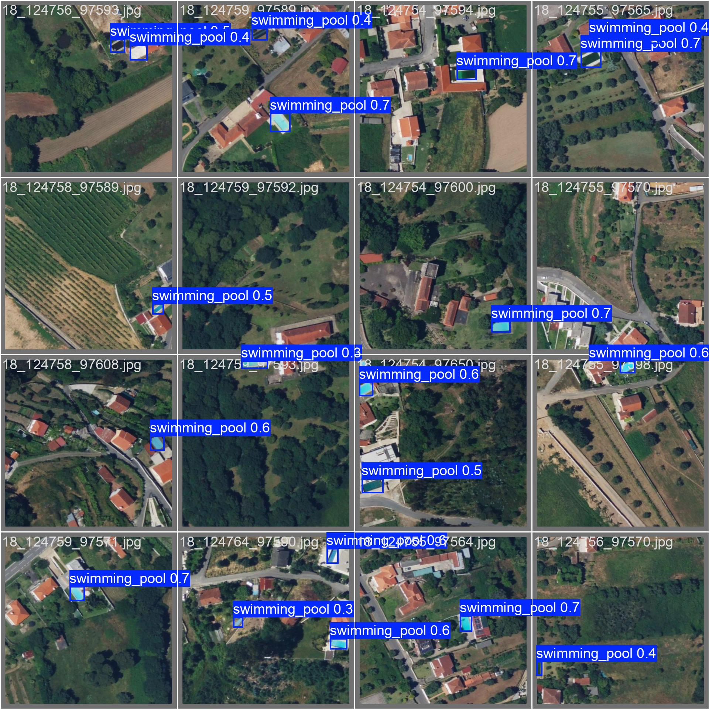

---
datasets:
- mozilla-ai/osm-swimming-pools
base_model: Ultralytics/YOLO11
library_name: ultralytics
pipeline_tag: object-detection
license: agpl-3.0
---

# swimming-pool-detector

Detect swimming_pools in satellite images.

Created with [osm-ai-helper](https://github.com/mozilla-ai/osm-ai-helper).

`yolo11m.pt` trained with [ultralytics](https://docs.ultralytics.com/tasks/detect/).

